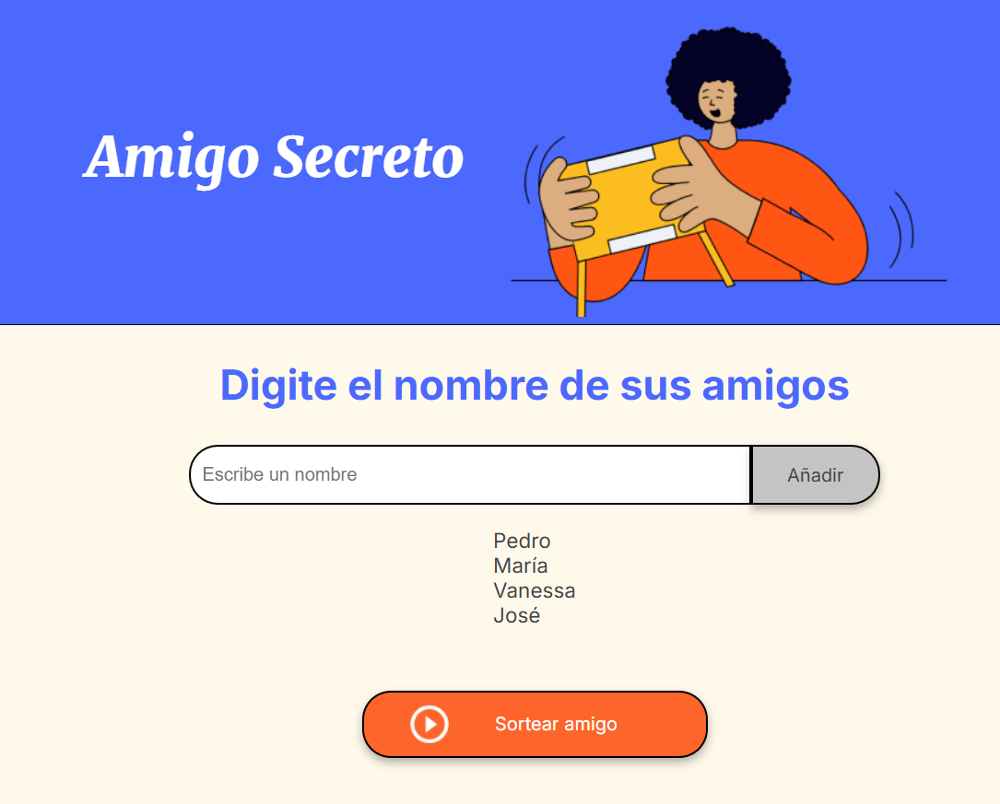

# Adivina el amigo secreto

## Descripción del proyecto:

Esta es una aplicación que permite seleccionar aleatoriamente el nombre de un amigo secreto entre una lista de participantes. Cada nombre se selecciona una sola vez, evitando repeticiones, y el resultado se muestra claramente en pantalla. También incluye la opción de reiniciar el juego para volver a empezar desde cero.

## Funcionalidades principales:

### Agregar nombres a la lista:

Los usuarios pueden escribir los nombres de los participantes en un campo de texto y agregarlos a la lista utilizando el botón "Añadir".

Los nombres ingresados se muestran en una lista en pantalla para confirmar que fueron añadidos correctamente.

### Sorteo aleatorio:

Al hacer clic en el botón "Sortear amigo", se selecciona un nombre al azar de la lista.

El nombre seleccionado se muestra como el ganador, y se elimina de la lista de participantes para evitar repeticiones.

El sorteo continúa hasta que se hayan seleccionado todos los nombres.

### Reiniciar el juego:

* La aplicación incluye un botón de reinicio que permite:

* Limpiar la lista de participantes y los resultados.

* Restablecer el campo de entrada de texto.

* Preparar todo para un nuevo sorteo desde cero.

## Instrucciones de uso:

### Cómo funciona la aplicación:

Al ingresar a la aplicación, verás un campo donde puedes escribir los nombres de los participantes y un botón "Añadir". Agrega los nombres uno por uno.

Verifica que los nombres aparezcan en la lista en pantalla.

Cuando hayas terminado de agregar todos los nombres, presiona el botón "Sortear amigo" para seleccionar un ganador aleatorio o si quieres seguir seleccionando ganadores puedes seguir presiona el botón "Sortear amigo".

Observa el nombre del ganador en la lista de resultados.

Si deseas iniciar un nuevo juego, utiliza el botón "Reiniciar juego" para borrar todo y comenzar nuevamente.

## Notas importantes:

No se permiten nombres vacíos.

El sorteo garantiza que no se repitan nombres.

El juego no permite sortear si no hay nombres en la lista.

## Tecnologías utilizadas:

Este proyecto fue diseñado para practicar habilidades de lógica de programación con JavaScript. El código aprovecha las siguientes tecnologías:

* HTML: Para la estructura de la aplicación.

* CSS: Para el diseño proporcionado en el proyecto inicial.

* JavaScript: Para implementar la lógica del sorteo, la interacción con el DOM y la gestión de eventos.

## Estructura de carpetas:

```
proyecto/
|-- index.html
|-- style.css
|-- app.js
|-- assets/
    |-- amigo-secreto.png
    |-- listado_amigos.png
    |-- sorteo_ganador.png
    |-- play_circle_outline.png

```

## Imagen del proyecto:

Pantalla con nombres añadidos para jugar:



Pantalla con el resultado del sorteo:


## Consideraciones finales:

* Este proyecto es ideal para aprender y practicar las siguientes habilidades:

* Manipulación del DOM con JavaScript.

* Uso de arrays y métodos como push, splice, y Math.random.

* Implementación de lógica para evitar repeticiones y garantizar un flujo controlado.

* Creación de una experiencia de usuario intuitiva.


